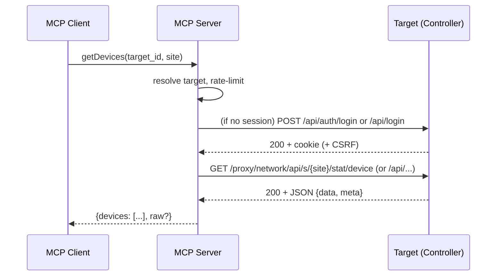

---
# Follow #enforce-spec.md for Design phase
---

# Design: UniFi Network MCP Server

## Overview
A Model Context Protocol (MCP) server that exposes read-only tools for retrieving UniFi Network controller data across multiple targets (controllers). It normalizes inventory, metrics, events/logs, and deployment information while preserving access to raw payloads on demand. Supports both UniFi OS (UDM/UDR/UXG) and classic controllers.

- **Scope**: Read-only for UniFi Network application endpoints.
- **Controllers**: Multiple targets, each with its own auth, TLS, rate limits, and default site.
- **Transport**: HTTPS with session-cookie auth. UniFi OS: `/api/auth/login` + `/proxy/network/api/...`. Classic: `/api/login` + `/api/...`.
- **Reliability**: Per-target rate limiting, timeouts, retries (idempotent GET), short TTL caching for low-volatility endpoints.

## Architecture

- **TargetRegistry**
  - Holds configured targets: `id`, `base_url`, `controller_type` (unifi_os|classic), `default_site`, `auth` (username/password or apiKey), `verify_ssl`, `ca_bundle_path?`, `timeout`, `rate_limit_per_sec`.

- **SessionManager**
  - Performs login and stores: `cookie_jar`, `csrf_token?`, `expires_at?`.
  - Re-authenticates on 401/440 or cookie expiry; thread-safe/session-per-target.

- **Router**
  - Builds paths per controller type.
  - Classic: `/api/s/{site}/{path}`.
  - UniFi OS: `/proxy/network/api/s/{site}/{path}`; top-level auth/self variations handled (`/api/users/self` vs `/api/self`).

- **HttpClient**
  - TLS: `verify_ssl` (default true), optional `ca_bundle_path`.
  - Timeouts and backoff retries for safe GETs.
  - Per-target rate limiter (token bucket).
  - Redacts secrets in logs; attaches cookies and `X-CSRF-Token` when required.

- **Cache**
  - Short TTL (e.g., 3–10s) for `stat/health`, `stat/sysinfo`.

- **Tool Handlers**
  - Each MCP tool validates input, resolves target+site, invokes Router+HttpClient, normalizes output, optionally returns `raw` payload when requested.

- **Error Normalizer**
  - Surfaces HTTP status, controller `meta.rc`/`meta.msg` (when present), and a stable error code/message.

### Sequence (login + request)

## Components and Interfaces

### Configuration
- Env var JSON (recommended) or external file:
  - `UNIFI_TARGETS` (array of controller targets)
  - `UNIFI_DEFAULT_TIMEOUT_MS`, `UNIFI_DEFAULT_RATE_LIMIT`
- Target record:
  - `id: string`
  - `base_url: string` (e.g., https://udm-pro.local)
  - `controller_type: "unifi_os" | "classic"`
  - `default_site: string` (e.g., "default")
  - `auth: { username: string, password: string } | { apiKey: string }`
  - `verify_ssl: boolean` (default true)
  - `ca_bundle_path?: string`
  - `timeout_ms?: number`
  - `rate_limit_per_sec?: number`

### MCP Tools (read-only)
- `listSites(target_id, raw?)`
  - Returns sites from `/integration/v1/sites` (API key) or `/api/self/sites` (legacy).
- `getSysinfo(target_id, site?, raw?)`
  - `GET /integration/v1/info` for Integration targets; legacy fallback to `stat/sysinfo` + `/status`.
- `getDevices(target_id, site?, raw?, macs?)`
  - `GET /integration/v1/sites/{siteId}/devices` for API key targets; legacy fallback `stat/device`/`stat/device-basic`.
- `getClients(target_id, site?, raw?, active_only?)`
  - `GET /integration/v1/sites/{siteId}/clients` for API key targets; legacy fallback `rest/user` + `stat/sta`.
- `getAlarms(target_id, site?, raw?, archived?)`
  - `GET stat/alarm` and optionally `rest/alarm`; only available for legacy session auth.

Inputs: all tools accept `target_id` and optional `site`; `raw` flag to include original payload. Outputs: normalized object plus optional `raw`.

### Normalized Data Models
- `Site { id: string, name: string, desc?: string }`
- `Device { mac: string, type?: string, model?: string, name?: string, ip?: string, version?: string, adopted?: boolean, state?: number, uptime?: number, site_id?: string }`
- `Client { mac: string, hostname?: string, ip?: string, user_id?: string, is_active?: boolean, ap_mac?: string, rx_bytes?: number, tx_bytes?: number, site_id?: string }`
- `Event { time: number, key?: string, msg?: string, user?: string, ap_mac?: string, site_id?: string }`
- `Alarm { time: number, key?: string, msg?: string, archived?: boolean, site_id?: string }`
- `Health { subcontrollers?: any[], num_user?: number, num_ap?: number, num_sw?: number, num_gw?: number }`
- `Sysinfo { version?: string, hostname?: string, uptime?: number, build?: string }`

Each tool may return `{ data: T | T[], truncated?: boolean, raw?: any }`.

## Error Handling
- Wrap HTTP and controller `meta` into:
  - `{ error: { code: string, http_status?: number, meta_rc?: string, meta_msg?: string, message: string } }`
- Common codes: `unauthorized`, `forbidden`, `not_found`, `timeout`, `tls_error`, `controller_error`, `network_error`.
- Re-authenticate automatically on 401; propagate otherwise.

## Security
- Secrets via env/config only; never logged. Redact `Authorization`, cookies, CSRF tokens, passwords.
- TLS verify true by default; warn when disabled; optional `ca_bundle_path`.

## Caching & Rate Limiting
- Default TTL: health/sysinfo 5s; configurable per-target.
- Token bucket per-target; default 5 req/s (configurable).

## Testing Strategy
- Unit tests: Router pathing (classic vs UniFi OS), SessionManager (login + reauth), Error Normalizer, rate limiting, caching.
- Contract tests: schema normalization from captured fixture payloads for devices/clients/events/alarms.
- Integration (optional, gated): run against a test controller with self-signed cert and both controller types.
- Negative tests: 401/403/5xx, timeouts, TLS off, truncated events (`meta.count`).

## Non-Goals
- Mutating endpoints (cmd/rest PUT/POST/DELETE), device control.
- WebSocket real-time streaming.
- Other UniFi applications (Protect, Talk, Access) beyond Network app.

## References
- UniFi Controller API (community reverse-engineered). Highlights: `/api/auth/login`, `/proxy/network/api/...`, `stat/*`, `rest/*`.
- Art of WiFi API client + API browser for endpoint coverage and UniFi OS notes.
- Unpoller client for schema examples.
- Official UniFi API getting started (aggregated).
